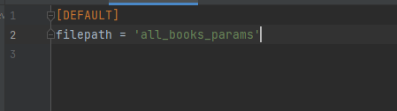

# Парсер книг с сайта tululu.org

## Запуск

- Скачайте код. Установите зависимости:
```sh
pip install -r requirements.txt
```
## script
Скрипт для скачивания книг с сайта `tululu.org`

- Запуск скрипта без аргументов:
```
python script.py
```
Скачаются книги с 1 по 10.<br>

У скрипта есть возможность указать параметры скачиваемых книг, существует три аргумента:
1. start_id - начальный id книги (стандартный параметр равен 1)
2. end_id - конечный id книги (стандартный параметр равен 10)
3. dest_folder -домашняя папка, куда скачиваются файлы(стандартный параметр равен папке, где находится скрипт)
- Запуск скрипта с аргументами:
```
python script.py 12 40 -f 'E:\lib'
```
Скачаются книги с 12 по 40, путь - E:\lib

## parse_tululu_category
Скрипт для скачивания книг с сайта `tululu.org` с определенной категории

- Запуск скрипта без аргументов:
```
python parse_tululu_category.py
```
Скачаются все книги категории научная фантастика.<br>

У скрипта есть возможность указать параметры скачиваемых книг, существует шесть аргументов:
1. start_page - начальный страница с книгами (стандартный параметр равен 1), сокращенное имя параметра -s 
2. end_page - конечная страница, перед которой следует остановить скачивание(стандартный параметр равен последней странице в категории), сокращенное имя параметра -e 
3. dest_folder -домашняя папка, куда скачиваются файлы(стандартный параметр папка, где находится скрипт), сокращенное имя параметра -f
4. skip_image -пропустить скачивание картинок(стандартный параметр скачивает картинки), сокращенное имя параметра -si
5. skip_txt -пропустить скачивание книг(стандартный параметр скачивает книги), сокращенное имя параметра -st
6. json_path -домашняя папка, куда скачивается файл с параметрами книг(стандартный параметр папка, где находится скрипт), сокращенное имя параметра -jp

```
python parse_tululu_category.py -s 700 -e 701 -f 'E:\lib\my' -si -jp 'E:\downloads'
```
Скачаются все книги категории научная фантастика, со страницы 700, в директорию 'E:\lib\my', <br>
без загрузки картинок, файл с параметрами книг скачается в папку 'E:\downloads'


## render_website

Скрипт для рендаринга страницы с книгами, скаченные ранее

- Запуск скрипта без аргументов:
```
python render_website.py
```
Страницы создадутся в папке pages.

В качестве аргумента можно указать путь к файлу с книгами:
```
python render_website.py -p "E:\Dev\parsing_online_library#3_devman\all_book"
```
Также можно указать данный параметр в файле config.ini. Создайте файл config.ini в той де директории, где находится скрипт, укажите в нем путь к файлу с книгами.



Пример библиотеки: https://trm888.github.io/parsing_online_library_devman/pages/index0.html


## Цели проекта

Код написан в образовательных целях на онлайн-курсе для веб-разработчиков [Devman](https://dvmn.org).
